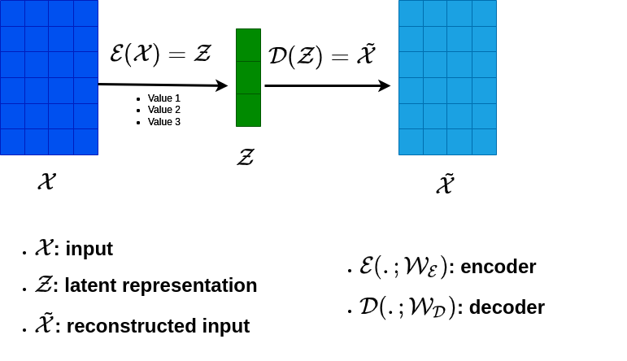
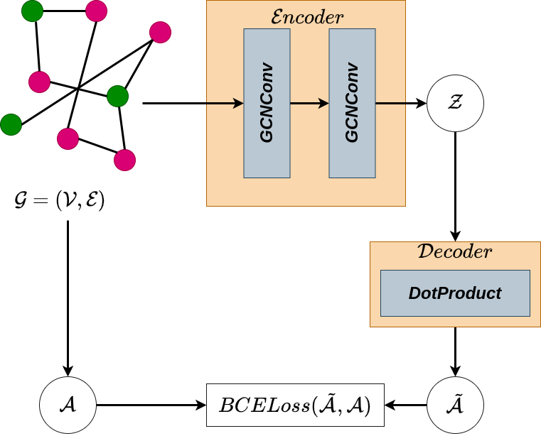

# Graph Variational Autoencoder (kipf et welling, NIPS Workshop 2016)

This reporsitory is an unofficial implementation of [2] GVAE.

### AutoEncoders
An autoencoder is a neural network that can be used to encode and decode data (figure 1). in such a network, the encoder is a neural network that takes an input and outputs a hidden representation (latent), and the decoder is a neural network that takes the hidden representation and tries to reconstruct the original input.

### Graph Autoencoder
A graph autoencoder is a graph neural network that can be used to encode graph structured data (figure 2). The encoder can be expresed as a graph neural network [1] that takes an input graph and outputs a hidden representation (latent). The decoder is a simple dot product that takes the hidden representation and tries to reconstruct the adjacency matrix.

### Run Experiments
To run experiments, you can use the `train.py` python file.

    python train.py --dataset cora --hidden-size 32 --code-size 16 --lr 0.01

available datasets are: cora, pubmed, citeseer

### Results

### Our results

| Dataset  | AUC   | AP    |
| -------- | ----- | ----- |
| Cora     | 92.74 | 93.38 |
| Citeseer | 91.64 | 92.44 |
| Pubmed   | --.-- | --.-- |

#### Reported results in paper

| Dataset  | AUC   | AP   |
| -------- | ----- | -----|
| Cora     | 91.4  | 92.6 |
| Citeseer | 90.8  | 92.0 |
| Pubmed   | 94.4  | 94.7 |

### References:

    [1] Kipf, Welling, et al. (2016). Semi-Supervised Learning with Graph Convolutional Networks.
    [2] Kipf, T., & Welling, M.. (2016). Variational Graph Auto-Encoders.

### TODO:
- [x] Implement the graph autoencoder
- [x] Run experiments on citation networks
- [x] Implement the graph variational autoencoder
- [ ] Write the GVAE section
- [ ] Add diagrams to the README (VGAE)
- [ ] Implement Dense GAE
